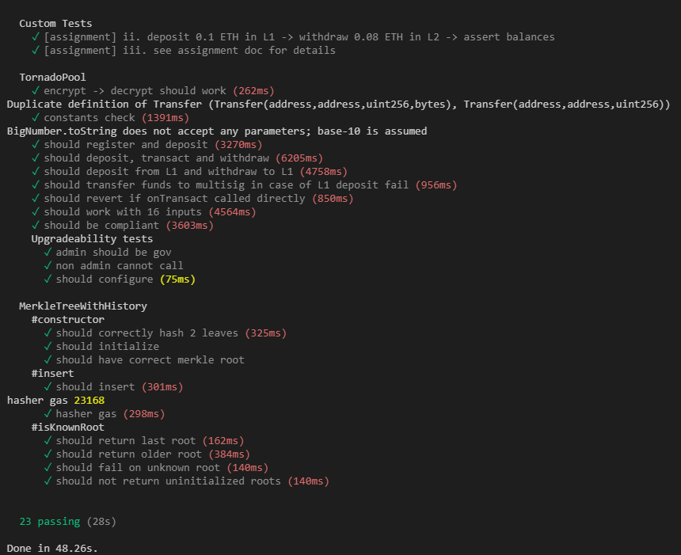

# zku.ONE C-4

**_Discord:_** mehultodi116@gmail.com  
**_Email:_** kid116#4889

## Week 1
### P1: Hashes & Merkle Trees

#### Q1
**Compare the four hashes and provide explanations in four different aspects: gas cost, capacity, proof generation efficiency, and proof size.**

- Gas Costs  
To hash two uint256 values on-chain requires the following gas (keep in mind that this may vary for different implementations):
    - MiMC: 59840
    - Poseidon: 49858
    - SHA256: 23179
- Proof Efficiency  
The following table gives us estimates for gas costs Merkle tree operations using MiMC and Posiedon
    <table>
        <caption>MiMC</caption>
        <thead>
            <tr>
                <th>Depth</th>
                <th>Capacity</th>
                <th>Initialisation gas cost</th>
                <th>Insertion gas cost</th>
                <th>Path verification circuit constraints</th>
            </tr>
        </thead>
        <tbody>
            <tr>
                <td>10</td>
                <td>1,024</td>
                <td>1,289,360</td>
                <td>528,298</td>
                <td>13,230</td>
            </tr>
            <tr>
                <td>20</td>
                <td>1,048,576</td>
                <td>2,075,640</td>
                <td>969,498</td>
                <td>26,460</td>
            </tr>
            <tr>
                <td>30</td>
                <td>107,3741,824</td>
                <td>2,861,920</td>
                <td>1,410,634</td>
                <td>39,690</td>
            </tr>
        </tbody>
    </table>

    <table>
        <caption>Poseidon</caption>
        <thead>
            <tr>
                <th>Depth</th>
                <th>Capacity</th>
                <th>Initialisation gas cost</th>
                <th>Insertion gas cost</th>
                <th>Path verification circuit constraints</th>
            </tr>
        </thead>
        <tbody>
            <tr>
                <td>10</td>
                <td>1,024</td>
                <td>1,317,741</td>
                <td>427,238</td>
                <td>2,190</td>
            </tr>
            <tr>
                <td>20</td>
                <td>1,048,576</td>
                <td>2,003,430</td>
                <td>767,565</td>
                <td>4,380</td>
            </tr>
            <tr>
                <td>30</td>
                <td>1,073,741,824</td>
                <td>2,689,180</td>
                <td>1,107,895</td>
                <td>6,570</td>
            </tr>
        </tbody>
    </table>

    It can be observed that the insertion gas cost using Poseidon is lower than MiMC and the path verification circuit constraints are also significantly lower. The gas cost for SHA256 is even lower but since it is not zk-friendly, it is not efficient for the user to generate proof when sha256 is employed. Pedersen trees are also extremely efficient in zk-circuits. Proving time for SHA256 is the best among all proving schemes and hashes.

- Proof Size  
The proof size depends on the proving scheme and not the hashes.

- Capacity  
The Merkle tree capacity is not dependent on the hash used and is a function of the tree depth: `size = 2^depth`. However, the use of Quinary Merkle trees using the PoseidonT6 hash which can hash 5 values together at once has significantly higher capacity than its counterparts for the same depth as each node can have not two but 5 child nodes. For Quinary Merkle trees: `size = 5^depth`.

#### Q3
**4 - Run `npx hardhat test` and attach a screenshot of all the tests passing.**

### P2: Tornado Cash

#### Q1
**How is Tornado Cash Nova different from Tornado Cash Classic? What are the key upgrades/improvements and what changes in the technical design make these possible?**

Tornado Cash Nova has the following differences/upgrades from Classic:
- Users are no longer restricted by fixed-amount transactions.
- Pool size is arbitrary.
- The ability to transfer token to another address within the mixer contract in L2 known as shielded transfers.

Tornado Cash Nova makes use of Gnosis Chain as L2 to optimize speed and cost which makes these upgrades possible.

#### Q2
**What is the role of the relayers in the Tornado Cash protocols? Why are relayers needed?**

Relayers provide the service of paying gas fees for transactions to maintain its anonymity. Gas fees payments are necessary for transactions. Going through our wallet for this gas fee can compromise the anonymity of the transaction if used ETH are linkable to our identity. Therefore, it is recommended to use a Relayer to preserve privacy. Anyone can become a relayer as long as they can spare 300 TORN as stake.

Relayers are needed to solve the famous "fee-payment dilemma" and maintain privacy of transaction which is the very essence of TornadoCash.

#### Q3
**1 - Run `yarn test` and attach a screenshot of all the tests passing.**

### P3: Semaphore

#### Q1
**What is Semaphore? Explain how it works.**

Semaphore is a system which allows any Ethereum user to signal their endorsement of an arbitrary string, revealing only that they have been previously approved to do so, and not their specific identity. To be precise, it lets a user:
- Register their identity in a smart contract, and
- Broadcast a signal that:
    - anonymously prove that their identity is in the set of registered identities, and at the same time:
    - Publicly store an arbitrary string in the contract, if and only if that string is unique to the user and the contract’s current external nullifier. This means that double-signalling the same message under the same external nullifier is not possible. External nullifier can be throught of as a topic on which the user may comment only once.

When a user registers their identity, they send a hash of an EdDSA public key and two random secrets to the contract, which stores it in a Merkle tree. This hash is called an identity commitment, and the random secrets are the identity nullifier and identity trapdoor. The user may create the following proofs 
using zk-SNARKs to interact with the Semaphore contract:
- That the identity commitment exists in the Merkle tree.
- That the signal was only broadcast once.
- That the signal was broadcasted by the user who generated the proof.

#### Q2
**How does Semaphore prevent double signing (or double withdrawal in the case of mixers)?**

By assigning the contract address to be the semaphore's external nullifier and the signal being the recepient's address, relayer's address, and fee, the contract only allows registered user to spend their funds once eliminating the threat of double spending. 

#### Q3
**Can you suggest two more ideas for ZK applications that can be built upon Semaphore?**

- Anonymous authentication integrated with a platform for journalism will allow the source of an article to remain anonymous while maintaining authenticity of the article.
- Semaphores can be used in tandem with Mixers to anonymously donate to organisations. The outputs from the mixer will go to non-profit organisations but no one can identify which donor has donated to which organisation.
